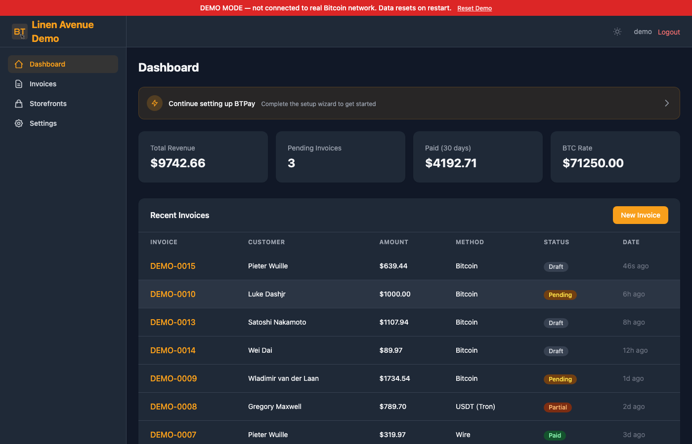

<p align="center">
  <a href="https://btpay.org">
    
  </a>
</p>

<p align="center">
  <strong>Self-hosted Bitcoin payment processor.</strong><br>
  No third parties. No monthly fees. Full control of your keys.
</p>

> **Alpha Software** -- BTPay is in early alpha and under active development. Things may change. Please test thoroughly before using in production and keep regular backups.

<p align="center">
  <a href="https://btpay-demo.onrender.com/">Live Demo</a> ·
  <a href="https://btpay.org">Website</a> ·
  <a href="#quick-start">Quick Start</a> ·
  <a href="docs/API.md">API Reference</a> ·
  <a href="docs/CONFIGURATION.md">Configuration</a> ·
  <a href="docs/DEPLOYMENT.md">Deployment</a> ·
  <a href="#license">License</a>
</p>

<p align="center">
  <a href="https://render.com/deploy?repo=https://github.com/btpay-org/btpay"></a>
  <a href="https://railway.com/template?referralCode=btpay&template=https://github.com/btpay-org/btpay"></a>
  <a href="https://heroku.com/deploy?template=https://github.com/btpay-org/btpay"></a>
</p>

<p align="center">
  
</p>

---

A lightweight, privacy-focused alternative to <a href="https://btcpayserver.org/">BTCPay Server</a>.

**Q:** Why is the name so similar to BTCPay?

**A:** My hope is the confusion makes Nicolas 🫶 and Kukks 🫶 learn Python and adopt this. Just kidding, what they built is amazing. They will never learn to python. So we will keep this alternative running for the very few who need it done correctly but with a much smaller subset of features. The real asnwer the is pip and domains were available. Please consider checking out their project <a href="https://btcpayserver.org/">BTCPS</a> and donating to <a href="https://opensats.org/">OpenSats</a>

## Features

### [Payments](#payments)
- **On-chain Bitcoin** — xpub, output descriptors, or static address lists with [BIP32 HD key derivation](https://github.com/bitcoin/bips/blob/master/bip-0032.mediawiki)
- **BTCPay Server** — connect to your self-hosted instance for invoice creation and payment tracking
- **LNbits** — Lightning Network payments with automatic fiat-to-sats conversion
- **Stablecoins** — USDC, USDT, DAI, PYUSD across 8 chains (Ethereum, Arbitrum, Base, Polygon, Optimism, Avalanche, Tron, Solana)
- **Wire transfer** — display bank details for fiat payments
- **Multi-source exchange rates** — CoinGecko, Coinbase, Kraken, Bitstamp, [mempool.space](https://mempool.space) with outlier detection

### [Bitcoin Verification](#bitcoin-verification)
- **SPV verification** — [Electrum protocol](https://electrumx.readthedocs.io/en/latest/protocol.html) + [mempool.space API](https://mempool.space/docs/api) for payment monitoring
- **Electrum server selection** — Sparrow Wallet-style UI with public/private servers, peer discovery, and SOCKS5 proxy

### [Invoicing & Checkout](#invoicing--checkout)
- **Invoicing** — create, finalize, track, and generate PDF invoices and receipts
- **Invoice search & export** — filter by status/date/customer, CSV export
- **Payment links** — shareable links for fixed or open-amount payments

### [Storefronts & Donations](#storefronts)
- **Product storefronts** — public-facing product catalog with fixed prices, categories, and inventory tracking
- **Donation pages** — preset amounts, custom donations, fundraising goals with progress tracking
- **Public URLs** — shareable `/s/<slug>` links, no authentication required for buyers
- **Cart checkout** — multi-item purchases with automatic invoice creation
- **Post-payment fulfillment** — idempotent inventory decrement and revenue tracking

### [Integrations](#api)
- **[REST API](docs/API.md)** — full API with Bearer token authentication for store integrations
- **[Webhooks](#webhooks)** — HMAC-SHA256 signed event notifications with automatic retry
- **Email notifications** — SMTP and Mailgun integration for invoice and payment emails
- **Notification preferences** — per-org toggles for which emails to send

### [Access & Security](#security)
- **Multi-user** — organizations with role-based access (owner/admin/viewer)
- **Team invites** — shareable invite links, no email setup required
- **2FA** — TOTP two-factor authentication with QR code setup
- **Account security** — password change and 2FA management in settings

### Software Updates
- **Self-update** — check for new versions and update from **Settings > Software Update** or via CLI
- **Two update paths** — pull from GitHub (supports SOCKS5/Tor proxy) or upload a release ZIP for air-gapped deployments
- **Pre-update backups** — automatic code and data backups before every update with one-click rollback

### Infrastructure
- **Privacy** — no telemetry, no tracking, Tor-friendly via SOCKS5 proxy
- **Dark/light themes** — clean UI with [Tailwind CSS](https://tailwindcss.com)
- **No database** — in-memory ORM with JSON file persistence
- **Reproducible builds** — pinned dependencies with SHA-256 hash verification
- **Cross-platform** — macOS, Linux, FreeBSD

## Quick Start

```bash
# Clone
git clone https://github.com/btpay-org/btpay.git
cd btpay

# Create virtual environment
python3 -m venv .venv
source .venv/bin/activate

# Install (reproducible)
pip install --require-hashes -r requirements.lock
pip install -e . --no-deps

# Or: install latest (unpinned)
# pip install -e ".[dev]"

# Create admin user
flask --app app user-create \
  --email you@example.com \
  --password your-secure-password \
  --first-name Admin \
  --last-name User

# Run
python app.py
```

Open `http://localhost:5000` in your browser.

## Requirements

- Python 3.10+
- macOS, Linux, or FreeBSD
- Optional: [libsecp256k1](https://github.com/bitcoin-core/secp256k1) for faster key derivation (falls back to pure Python)

## Configuration

BTPay uses `config_default.py` for defaults. Override settings by creating a `config.py` in the project root or via environment variables prefixed with `BTPAY_`. See the full [Configuration Guide](docs/CONFIGURATION.md).

### Essential Settings

| Setting | Env Var | Default | Description |
|---------|---------|---------|-------------|
| `SECRET_KEY` | `BTPAY_SECRET_KEY` | (dev default) | Flask secret key — **change in production** |
| `REFNUM_KEY` | `BTPAY_REFNUM_KEY` | (dev default) | NaCl SecretBox key for reference numbers (32 bytes hex) |
| `REFNUM_NONCE` | `BTPAY_REFNUM_NONCE` | (dev default) | NaCl SecretBox nonce for reference numbers (24 bytes hex) |

### Bitcoin Settings

| Setting | Default | Description |
|---------|---------|-------------|
| `BTC_QUOTE_DEADLINE` | `30` | Minutes to lock the BTC exchange rate |
| `BTC_MARKUP_PERCENT` | `0` | Markup percentage on the exchange rate |
| `MAX_UNDERPAID_GIFT` | `5` | USD threshold to accept small underpayments |
| `EXCHANGE_RATE_SOURCES` | `['coingecko', 'coinbase', 'kraken']` | Rate source APIs |
| `EXCHANGE_RATE_INTERVAL` | `300` | Seconds between rate fetches |
| `BTC_CONFIRMATION_THRESHOLDS` | `[(100,1), (1000,3), (None,6)]` | Amount (USD) to required confirmations |

### Privacy Settings

| Setting | Env Var | Default | Description |
|---------|---------|---------|-------------|
| `SOCKS5_PROXY` | `BTPAY_SOCKS5_PROXY` | (empty) | SOCKS5 proxy for Tor (e.g. `socks5h://127.0.0.1:9050`) |
| `MEMPOOL_API_URL` | `BTPAY_MEMPOOL_URL` | `https://mempool.space/api` | Can point to [your own instance](https://github.com/mempool/mempool) |

### Email Settings

| Setting | Env Var | Default | Description |
|---------|---------|---------|-------------|
| `SMTP_CONFIG.host` | `BTPAY_SMTP_HOST` | (empty) | SMTP server hostname |
| `SMTP_CONFIG.port` | `BTPAY_SMTP_PORT` | `587` | SMTP port (587=TLS, 465=SSL) |
| `SMTP_CONFIG.username` | `BTPAY_SMTP_USER` | (empty) | SMTP username |
| `SMTP_CONFIG.password` | `BTPAY_SMTP_PASS` | (empty) | SMTP password |
| `SMTP_CONFIG.from_email` | `BTPAY_SMTP_FROM` | (empty) | From email address |

See [`config_default.py`](config_default.py) for the complete list of all configuration options.

## CLI Commands

```bash
# User management
flask --app app user-create          # Create admin user (interactive)
flask --app app user-list            # List all users
flask --app app user-reset-totp --email user@example.com  # Reset 2FA

# Wallet management
flask --app app wallet-create --org-id 1 --name "Main Wallet" --type xpub --xpub "zpub..."
flask --app app wallet-import --wallet-id 1 --file addresses.txt

# Data management
flask --app app db-export [output_dir]   # Export data to JSON
flask --app app db-import [input_dir]    # Import data from JSON
flask --app app db-backup                # Create timestamped backup
flask --app app db-stats                 # Show storage statistics

# Exchange rates
flask --app app rates                    # Show current rates

# Software updates
flask --app app check-updates            # Check for new versions
flask --app app update --version v0.2.0  # Update via git
flask --app app update --zip release.zip # Update from ZIP (air-gapped)
flask --app app update-rollback          # Rollback to previous version
```

## Wallet Types

BTPay supports three wallet types:

### xpub (Recommended)
Provide your hardware wallet's extended public key. BTPay derives fresh addresses using [BIP32](https://github.com/bitcoin/bips/blob/master/bip-0032.mediawiki). Supports:
- `xpub...` — P2PKH (legacy, `1...` addresses)
- `ypub...` — P2SH-P2WPKH (wrapped segwit, `3...` addresses)
- `zpub...` — P2WPKH (native segwit, `bc1q...` addresses)

### Output Descriptor
Standard [output descriptors](https://github.com/bitcoin/bitcoin/blob/master/doc/descriptors.md) for precise script control:
- `wpkh([fingerprint/path]xpub.../0/*)` — native segwit
- `sh(wpkh([fingerprint/path]xpub.../0/*))` — wrapped segwit
- `pkh([fingerprint/path]xpub.../0/*)` — legacy

### Address List
Import a plain text file with one Bitcoin address per line. Useful for pre-generated addresses or cold storage setups.

## Storefronts

Create public-facing product stores and donation pages — inspired by BTCPay Server's "Apps" feature.

### Store Mode

Set up a product catalog with fixed prices. Buyers browse at `/s/<your-slug>`, pick items, and check out through the standard invoice flow. Supports:
- Per-item images, descriptions, and categories
- Inventory tracking (unlimited or limited stock)
- Multi-item cart checkout
- Required buyer info (email, optional name)

### Donation Mode

Create a donation/tip page with preset amounts (e.g. $5, $10, $25, $50, $100) and optional custom amounts. Supports:
- Fundraising goals with progress bar
- Donor messages
- Custom CTA button text

### How It Works

1. Go to **Storefronts** in the sidebar and create a new storefront
2. Choose **Store** or **Donation** mode
3. Add items (store) or configure presets (donation)
4. Share the public URL: `https://your-instance.com/s/<slug>`

Purchases and donations create invoices automatically using your configured payment methods (Bitcoin, stablecoins, wire, BTCPay, LNbits). Inventory and revenue stats update after payment confirmation.

## API

Full [REST API](docs/API.md) at `/api/v1/`. Authenticate with Bearer tokens.

### Create an API Key
Go to **Settings > API Keys** and create a new key. The raw key is shown once — save it.

### Example: Create an Invoice

```bash
curl -X POST http://localhost:5000/api/v1/invoices \
  -H "Authorization: Bearer YOUR_API_KEY" \
  -H "Content-Type: application/json" \
  -d '{
    "customer_email": "customer@example.com",
    "customer_name": "Alice",
    "currency": "USD",
    "lines": [
      {"description": "Widget", "quantity": 2, "unit_price": "49.99"}
    ]
  }'
```

### Example: Get Invoice Status

```bash
curl http://localhost:5000/api/v1/invoices/INV-0001/status \
  -H "Authorization: Bearer YOUR_API_KEY"
```

See the complete [API Reference](docs/API.md) for all endpoints.

## Webhooks

Register webhook endpoints to receive real-time notifications:

```bash
curl -X POST http://localhost:5000/api/v1/webhooks \
  -H "Authorization: Bearer YOUR_API_KEY" \
  -H "Content-Type: application/json" \
  -d '{
    "url": "https://yoursite.com/webhook",
    "events": ["invoice.paid", "invoice.confirmed"]
  }'
```

Events: `invoice.created`, `invoice.paid`, `invoice.confirmed`, `invoice.expired`, `invoice.cancelled`, `payment.received`, `payment.confirmed`, or `*` for all.

Payloads are signed with HMAC-SHA256 via the `X-BTPay-Signature` header. Verify with the secret returned when creating the endpoint.

## Production Deployment

See the full [Deployment Guide](docs/DEPLOYMENT.md).

### Quick Production Setup

```bash
# Install
cd /opt/btpay
python3 -m venv .venv
source .venv/bin/activate
make install-locked

# Create config.py with production secrets
cat > config.py << 'EOF'
SECRET_KEY = 'your-random-64-char-hex-string'
REFNUM_KEY = 'your-random-64-char-hex-string'
REFNUM_NONCE = 'your-random-48-char-hex-string'
DEV_MODE = False
EOF

# Create admin user
flask --app app user-create

# Run with gunicorn
gunicorn -c deploy/gunicorn.conf.py wsgi:app
```

Pre-built configs are included:
- [`deploy/gunicorn.conf.py`](deploy/gunicorn.conf.py) — Gunicorn with gthread worker
- [`deploy/nginx.conf`](deploy/nginx.conf) — Nginx reverse proxy with TLS
- [`deploy/btpay.service`](deploy/btpay.service) — systemd service with security hardening

### Important: Single Worker

BTPay uses an in-memory data store. You **must** run gunicorn with a single worker (`workers = 1`). The default config handles this. Multiple threads are fine (`threads = 4`).

## Data Persistence

Data is stored as JSON files in the `data/` directory:
- Auto-saved every 60 seconds
- Saved on graceful shutdown (SIGTERM/SIGINT)
- Backup rotation keeps the last 5 backups

Back up the `data/` directory regularly. Use `flask db-backup` or `make backup` for manual backups.

## Security

- [Argon2id](https://en.wikipedia.org/wiki/Argon2) password hashing
- TOTP two-factor authentication with replay prevention
- Password change from account settings (requires current password)
- Server-side sessions (SHA-256 hashed tokens)
- CSRF protection on all forms
- Per-route rate limiting (login: 5/min, API: 100/min)
- NaCl SecretBox-encrypted reference numbers in URLs
- HMAC-SHA256 signed [webhook](#webhooks) payloads
- Security headers (HSTS, CSP, X-Frame-Options, etc.)
- Hack detection middleware (blocks exploit paths, injection attempts)
- Account lockout after 5 failed login attempts with exponential backoff
- Pinned dependencies with SHA-256 hash verification
- [systemd hardening](deploy/btpay.service) (PrivateTmp, ProtectSystem, NoNewPrivileges)
- TLS certificate verification for Electrum servers
- SSRF protection on external URLs
- Email header injection prevention

## Development

```bash
# Run tests
make test

# Run tests with coverage
make test-cov

# Run dev server
make run
```

859 user story tests and unit tests covering ORM, auth, Bitcoin key derivation, invoicing, storefronts, API, webhooks, email, frontend, account security, Electrum server selection, stablecoin monitoring, BTCPay Server, LNbits, and security middleware.

## Architecture

```
btpay/
  app.py                  # Flask app factory
  config_default.py       # Default configuration
  wsgi.py                 # Gunicorn entry point
  btpay/
    orm/                  # In-memory ORM (engine, model, query, columns, persistence)
    auth/                 # Authentication (models, sessions, totp, decorators, views)
    bitcoin/              # Bitcoin (xpub, descriptors, address pool, exchange, electrum, mempool, monitor)
    connectors/           # Payment connectors (BTCPay Server, LNbits, stablecoins, EVM RPC, wire)
    invoicing/            # Invoicing (models, service, checkout, payment methods, PDF, wire)
    storefront/           # Storefronts & donations (models, admin views, public views, fulfillment)
    api/                  # REST API (routes, serializers, webhooks)
    frontend/             # Web UI (dashboard, invoices, checkout, settings, filters)
    security/             # Security (tokens, hashing, crypto, validators, rate limit, csrf, middleware)
    email/                # Email (service, templates)
  templates/              # Jinja2 templates
  static/                 # CSS, JS, images
  tests/                  # 859 tests
  deploy/                 # gunicorn, nginx, systemd configs
```

## Future Plans

- LND / CLN direct integration (currently supported via [BTCPay Server](https://btcpayserver.org) and [LNbits](https://lnbits.com))
- LNURL-Pay and Lightning Address
- [Silent Payments](https://github.com/bitcoin/bips/blob/master/bip-0352.mediawiki) (BIP352)
- [PayJoin](https://github.com/bitcoin/bips/blob/master/bip-0078.mediawiki) (BIP78)
- Taproot (P2TR) addresses

## Test Coverage

859 tests across 14 test modules:

| Module | Tests | Covers |
|--------|------:|--------|
| `test_user_stories` | 378 | End-to-end user flows, storefronts, and integration scenarios |
| `test_bitcoin` | 102 | xpub derivation, descriptors, address pool, exchange rates, Electrum, mempool |
| `test_connectors` | 67 | Stablecoin monitoring, EVM RPC, wire transfers |
| `test_auth` | 60 | Login, sessions, TOTP 2FA, account lockout, password changes |
| `test_invoicing` | 58 | Invoice lifecycle, payment methods, PDF generation |
| `test_api` | 52 | REST API endpoints, authentication, webhooks |
| `test_orm` | 35 | In-memory ORM engine, models, queries, columns, persistence |
| `test_btcpay` | 25 | BTCPay Server connector |
| `test_lnbits` | 24 | LNbits connector |
| `test_phase7` | 21 | Security middleware, hack detection, rate limiting |
| `test_security_fixes` | 19 | Security hardening and vulnerability fixes |
| `test_refnums` | 9 | NaCl SecretBox-encrypted reference numbers |
| `test_tokens` | 5 | Token hashing and verification |
| `test_chrono` | 4 | Date/time utilities |

```bash
# Run all tests
make test

# Run tests with coverage report
make test-cov
```

## Disclaimer

THIS SOFTWARE IS PROVIDED "AS IS", WITHOUT WARRANTY OF ANY KIND, EXPRESS OR IMPLIED, INCLUDING BUT NOT LIMITED TO THE WARRANTIES OF MERCHANTABILITY, FITNESS FOR A PARTICULAR PURPOSE, AND NONINFRINGEMENT. IN NO EVENT SHALL THE AUTHORS OR COPYRIGHT HOLDERS BE LIABLE FOR ANY CLAIM, DAMAGES, OR OTHER LIABILITY, WHETHER IN AN ACTION OF CONTRACT, TORT, OR OTHERWISE, ARISING FROM, OUT OF, OR IN CONNECTION WITH THE SOFTWARE OR THE USE OR OTHER DEALINGS IN THE SOFTWARE.

BTPay handles financial transactions. The authors and contributors are not responsible for any loss of funds, data, or business arising from the use of this software. You are solely responsible for securing your deployment, keys, and data. Use at your own risk.

## License

[MIT](LICENSE)
